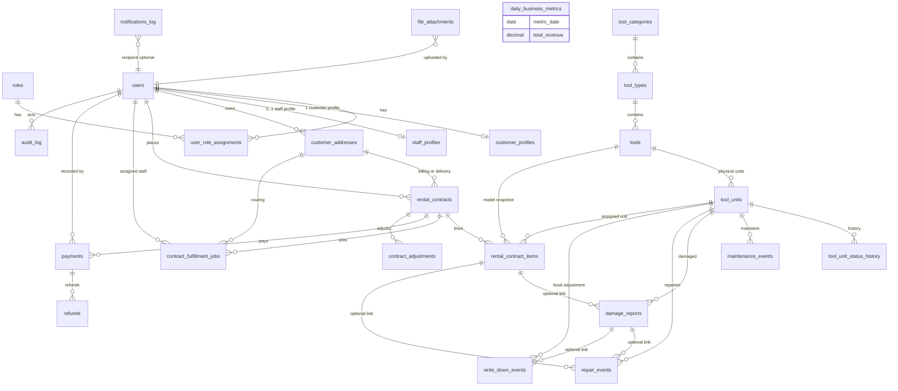

# Rocket Rentals — Database Schema (v2)

## Overview

This document describes the **operational rental** schema for the Rocket Rentals platform. The database centers on a preserved catalog hierarchy (`tool_categories` → `tool_types` → `tools` → `tool_units`) and adds identity, rental contracts, fulfillment jobs, financial records, reporting snapshots, audit trails, and file metadata suitable for a production-minded MySQL/MariaDB deployment.

The canonical initialization script is [`init.sql`](init.sql). Run it against an empty schema (or after dropping prior objects) to create tables, constraints, indexes, and minimal seed data for roles and a sample contract.

---

## Mermaid ERD

The diagram below is a **logical** view: not every column is shown; polymorphic links (e.g. `file_attachments.entity_type` + `entity_id`) appear as notes.

**Polymorphic / soft links**

- `file_attachments` stores `entity_type` + `entity_id` (and optional FK columns on `rental_contracts.signature_attachment_id` and `contract_fulfillment_jobs.proof_attachment_id` for strong links where needed).
- `audit_log` records arbitrary entities via `entity_type` + `entity_id`.

---

## Domain-by-domain explanation

### 1. Identity and access

| Table | Purpose |
|--------|---------|
| `roles` | Canonical role names (`customer`, `associate`, `admin`). Permissions are enforced in application code; the DB stores assignments only. |
| `users` | Single login identity: email, password hash, active flag, verification and login timestamps. |
| `user_role_assignments` | Many-to-many: which users hold which roles. A user may have multiple roles in advanced setups (e.g. internal tester). |
| `customer_profiles` | One row per customer user: name, phone, lightweight ID verification fields (last four only), marketing preference, internal notes. |
| `staff_profiles` | One row per internal user: employee id, department, employment status, contact fields. |
| `customer_addresses` | Multiple saved addresses per customer; supports default flag and delivery instructions. |

**Why this shape:** One `users` table avoids duplicated auth logic across “customer” and “staff” tables while still separating domain-specific attributes into profiles.

---

### 2. Catalog and inventory

| Table | Purpose |
|--------|---------|
| `tool_categories` | Top-level navigation groups (sidebar, marketing). |
| `tool_types` | Subgroups within a category. |
| `tools` | Rentable **models** (product card): current list `daily_rate` and suggested `deposit` for quoting—not the legal price on past contracts. |
| `tool_units` | Physical assets: `asset_tag`, `serial_number`, `condition`, `operational_status`, **`status`** (rental-pool state: available, rented, reserved, etc.), location, costs, dates, notes. The column name `status` matches v1 for existing queries. |
| `tool_unit_status_history` | Append-only style history when `status` or `operational_status` changes, with optional link to `rental_contracts`. |
| `maintenance_events` | Scheduled or ad hoc maintenance/repair/cleaning with optional cost and timestamps. |
| `damage_reports` | Structured damage records tied to a unit and optionally a contract line. |

**Why this shape:** The catalog chain is unchanged conceptually; operational detail lives on `tool_units` and satellite tables so reporting and audits stay accurate.

---

### 3. Rental contracts and line items

| Table | Purpose |
|--------|---------|
| `rental_contracts` | Business agreement: unique `contract_number`, customer, optional billing/delivery addresses, lifecycle `status`, scheduled vs actual dates, monetary totals, terms/signature timestamps, notes. |
| `rental_contract_items` | One row per model (and optionally specific `tool_unit_id`) with **snapshots**: `daily_rate_snapshot`, `deposit_snapshot`, `rental_days`, `line_subtotal`, line `item_status`. |

**Contract statuses:** `draft`, `scheduled`, `confirmed`, `active`, `closed`, `cancelled`.

---

### 4. Fulfillment (delivery and pickup)

| Table | Purpose |
|--------|---------|
| `contract_fulfillment_jobs` | Operational jobs per contract: `delivery` or `pickup`, `job_status`, assigned staff, schedule, arrival/completion times, optional proof attachment, notes. |

**Job statuses:** `unassigned`, `assigned`, `in_progress`, `completed`, `failed`, `rescheduled`, `cancelled`.

---

### 5. Financial tracking

| Table | Purpose |
|--------|---------|
| `payments` | Charges and deposits per contract: amount, type (`rental_charge`, `deposit`, `balance`, etc.), method, provider ids for Stripe/Square-style integration, status, idempotency key. |
| `refunds` | Rows linked to `payments` for partial or full refunds. |
| `contract_adjustments` | Discounts, late fees, damage fees, credits, write-offs, tax corrections—signed amounts with reason and creator. |
| `repair_events` | Repair spend tied to a unit and optionally a contract line or damage report. |
| `write_down_events` | Inventory markdown or loss (book value reduction), optionally linked to damage. |

**Payment statuses:** `pending`, `authorized`, `paid`, `failed`, `refunded`, `partially_refunded`.

---

### 6. Reporting snapshots

| Table | Purpose |
|--------|---------|
| `daily_business_metrics` | **Optional** pre-aggregated row per calendar day for dashboards (revenue, counts, repair/write-down totals, deposits held snapshot, overdue count, utilization). Populated by a batch job, not authoritative for accounting. |

---

### 7. Audit, notifications, files

| Table | Purpose |
|--------|---------|
| `audit_log` | Who changed what: actor, action, entity key, optional JSON old/new payloads, IP/user agent, timestamp. |
| `notifications_log` | Outbound notification attempts (email/SMS/push/in-app): template, payload, provider id, status, errors. |
| `file_attachments` | Metadata for objects in object storage (`object_key`, bucket, MIME, size); polymorphic `entity_type`/`entity_id` plus `purpose` (signature, delivery photo, etc.). |

---

## Table glossary

| Table | One-line description |
|-------|----------------------|
| `roles` | Named roles for RBAC. |
| `users` | Login identities for all personas. |
| `user_role_assignments` | User ↔ role links. |
| `customer_profiles` | Customer-specific PII and verification hints. |
| `staff_profiles` | Internal employment and contact data. |
| `customer_addresses` | Saved delivery/billing addresses. |
| `tool_categories` | Top-level catalog groups. |
| `tool_types` | Subgroups within categories. |
| `tools` | Product models and current list pricing. |
| `tool_units` | Physical inventory items. |
| `tool_unit_status_history` | Historical changes to unit states. |
| `maintenance_events` | Maintenance/repair/cleaning work on units. |
| `damage_reports` | Reported damage with severity and resolution tracking. |
| `rental_contracts` | Rental agreements and totals. |
| `rental_contract_items` | Line-level snapshots and line status. |
| `contract_fulfillment_jobs` | Delivery/pickup scheduling and execution. |
| `payments` | Money in (charges/deposits). |
| `refunds` | Money out tied to payments. |
| `contract_adjustments` | Non-payment ledger movements on a contract. |
| `repair_events` | Repair costs for analytics and COGS-style views. |
| `write_down_events` | Asset markdown/loss events. |
| `daily_business_metrics` | Cached daily KPIs. |
| `audit_log` | Compliance-oriented change log. |
| `notifications_log` | Notification pipeline history. |
| `file_attachments` | Pointers to external binary storage. |

---

## Workflows

### Customer workflow

1. Register/login as a `users` row with role `customer` and a `customer_profiles` row.
2. Add `customer_addresses` for delivery or pickup.
3. Browse `tools`; availability is driven by `tool_units.status` and scheduling rules in the application.
4. Create a `rental_contracts` row (often starting as `draft`/`scheduled`) and `rental_contract_items` with **snapshotted** rates and deposits.
5. Pay `payments` (e.g. deposit online via card provider).
6. Receive fulfillment per `contract_fulfillment_jobs` (delivery/pickup times and proof photos via `file_attachments`).
7. On return, line `item_status` moves to `returned`; contract may `close`; deposits settle via `payments`/`refunds`/`contract_adjustments`.

### Associate workflow

1. Login as user with role `associate` and `staff_profiles`.
2. View `contract_fulfillment_jobs` filtered by `job_status` (`unassigned` queue), assign `assigned_staff_user_id` to self or peer.
3. Update job `job_status` and timestamps; attach proof via `file_attachments` / `proof_attachment_id`.
4. Update inventory: `tool_units.status`, `tool_unit_status_history`, `maintenance_events`, `damage_reports`, `repair_events` as operations require.
5. Record in-person or phone-assisted payments with `payments` rows (provider fields as needed).

**Data access note:** Associates should see operational and customer-facing operational data; **business-wide revenue dashboards** and sensitive settings should be restricted at the API layer to `admin` (and optionally specific columns via views or separate read models).

### Admin workflow

1. Full read access to `rental_contracts`, financial tables, `daily_business_metrics`, and staff/customer oversight.
2. Manage `contract_adjustments`, approve `write_down_events`, reconcile `payments`/`refunds`.
3. Configure catalog (`tools`, `tool_units` costs), review `audit_log` and failed `notifications_log` entries.

### Future cloud / mobile workflow

- **Auth:** Same `users` + `password_hash` (or migrate to external IdP; keep stable `users.id` as FK anchor).
- **Push/SMS/email:** Insert `notifications_log` rows from workers; track delivery state.
- **Signed contracts:** Store PDF/signature images in S3; reference via `file_attachments` and `rental_contracts.signed_at` / `signature_attachment_id`.
- **Offline-capable apps:** Sync contracts and jobs by `updated_at` and job id; conflicts resolved in the API using `audit_log` patterns.

---

## Design rationale

### Why pricing is copied onto `rental_contract_items`

List prices on `tools` change. Legal and accounting truth for a past rental is the **price at booking**. Snapshots (`daily_rate_snapshot`, `deposit_snapshot`, `line_subtotal`) make invoices, disputes, and reports deterministic without historical price tables.

### Why fulfillment jobs are separate from `rental_contracts`

A contract is the **commercial** record (parties, money, dates). Deliveries and pickups are **operational** work items with their own lifecycle (assign, reschedule, fail, complete). Multiple jobs per contract (e.g. redelivery), multiple staff touches, and photo proof map cleanly to `contract_fulfillment_jobs` without overloading the contract row.

### Why metrics are derived from transactions

`daily_business_metrics` is a **cache** for fast dashboards. Authoritative money and activity come from `payments`, `refunds`, `contract_adjustments`, `rental_contracts`, `repair_events`, and `write_down_events`. Rebuild metrics if a bug ever corrupts snapshots.

### Why audit and unit history tables exist

- **`audit_log`:** Security, dispute resolution, and SOX-style accountability for who changed contracts, money, or inventory.
- **`tool_unit_status_history`:** Explains *why* a unit moved from available to rented or maintenance without rewriting past contract lines.

### Why files are referenced, not stored as BLOBs

Binary data in the DB complicates backups, scaling, and CDN delivery. `file_attachments` stores immutable object keys and metadata; the app uploads to S3/GCS and serves via signed URLs.

---

## Notes for future development

| Topic | Guidance |
|-------|----------|
| **Auth integration** | Keep `users.id` stable; swap `password_hash` for OAuth subject mapping or add `external_auth_provider` + `external_subject` if needed. |
| **Notifications** | Queue workers read `notifications_log` status; retry failed rows; template keys stay versioned in app config. |
| **Analytics / dashboard jobs** | Nightly job: aggregate into `daily_business_metrics`; optionally materialize views for associate KPIs (on-time delivery rate) from `contract_fulfillment_jobs`. |
| **Storage** | Use `storage_provider` + `bucket_or_container` + `object_key`; lifecycle policies in the bucket (e.g. delete proof photos after N years per policy). |
| **Scaling** | Partition large append-only tables (`audit_log`, `notifications_log`, `tool_unit_status_history`) by date when volume warrants; keep hot indexes on `rental_contracts(status, scheduled_start)` and `contract_fulfillment_jobs(job_status, scheduled_at)`. |

---

## Quick reference: foreign key philosophy

- **Contracts and money:** Prefer `RESTRICT` or careful `CASCADE` so deleting a customer does not silently delete financial history; in production, often **soft-delete** users instead of `DELETE`.
- **Fulfillment jobs:** `ON DELETE CASCADE` from contract is acceptable if jobs are purely derivative of the contract (tune per compliance needs).
- **Files:** `ON DELETE SET NULL` on optional attachment FKs avoids orphaning contracts when a file row is removed.

For exact `ON DELETE`/`ON UPDATE` behavior, see the comments and constraint definitions in [`init.sql`](init.sql).
